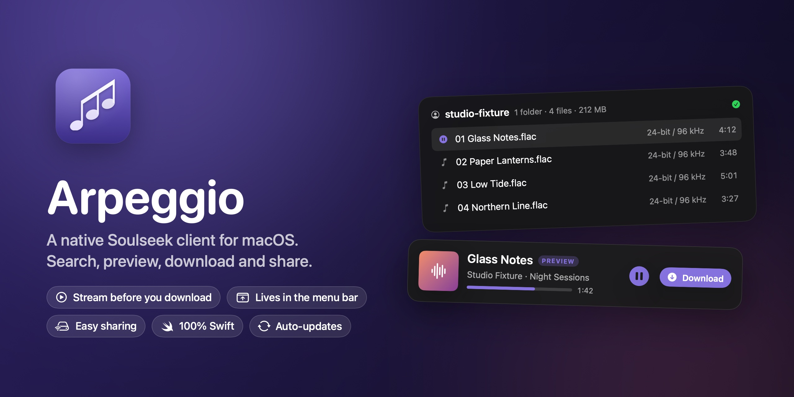

<p align="center"></p>

# Soulseek-Arpeggio

Soulseek-Arpeggio (Arpeggio for short) is a native Soulseek client for macOS, written in Swift and SwiftUI. It talks to the Soulseek server and to other people directly, with no wrapper, daemon or web view in between.

Soulseek is a long-running peer-to-peer network where people share their music libraries with each other. You search everyone who is online, download straight from them, and share your own folders in return.

## What it does

- **Search** the whole network. Results stream in live and are grouped by person, album and track, with quick filters for lossless, hi-res and bitrate.
- **Preview first.** Preview native audio, video, images and PDFs from Search, Browse or Transfers, including with Space. Supported audio can stream while bytes arrive; other files fetch into a temporary cache before opening in macOS playback or Quick Look. Codec support depends on macOS. Previews are limited to 512 MB and a five-minute fetch deadline. Keep them with Download, or close to discard.
- **Download** single files or whole albums. Each album lands in its own folder. There are no per-user, "incomplete" or "complete" folders unless you ask for them.
- **Share** folders with a drag and drop. See what you share, how big it is, and who is downloading from you right now.
- **Sharing policy and indexing.** Settings > Sharing and the welcome guide let you require sharing before someone downloads from you, with a configurable automatic message. Only fresh confirmed zero-share counts are declined; unknown counts are allowed. Messages are throttled per account and user. Indexing reports its current folder and actual files processed, without estimating an unknown total. The welcome guide offers both your Music folder and a prominent custom-folder picker.
- **Stay in the menu bar.** Close the window and Arpeggio keeps sharing. The menu bar icon shows whether you are offline, available, away or uploading.
- **Statistics** count everything you have downloaded and uploaded since you started, in the sidebar and in Settings > Statistics. Totals are in decimal gigabytes (1 GB = 1,000,000,000 bytes) with completed file counts. Copy a text summary, or copy, save or share a 1200 x 676 picture. Your username and profile picture appear only if you turn them on.
- **Basic Soulseek workflows:** wishlist searches, received searches, browsing someone's library, private messages, chat rooms, a user list with trusted and ignored people, Available and Away status, your own picture and description, upload slots, speed limits and per-user queue limits. This is not a promise of exhaustive parity with mature clients.
- **Pause entire directions.** Pause or resume Uploads and Downloads independently from the menu bar or Network menu. Active sockets stop, queues remain, and downloads resume from partial bytes. Presence stays unchanged. These controls are session-only.
- **Router diagnostics.** Choose NAT-PMP and UPnP independently. Arpeggio reports actual mapping acknowledgments, not assumed compatibility or external reachability. Check Ports tests the local TCP listener. Check External Reachability contacts Soulseek's HTTPS port checker only after confirmation, with no credentials. It tests the public route used by that request; VPN routes may differ. Listening ports are never changed automatically.
- **Updates itself** from GitHub Releases, and only installs updates signed by the same developer.

## Install

1. Download `Soulseek-Arpeggio-x.y.z.zip` from the [latest release](https://github.com/Ashref-dev/soulseek-client-mac/releases/latest).
2. Unzip it and move **Soulseek-Arpeggio** to Applications. Search for "Soulseek" or "Arpeggio" in Spotlight to open it.
3. Open it. Release builds are signed but not notarized yet, so the first time macOS may refuse to open it. Choose **System Settings > Privacy & Security > Open Anyway**, or Control-click the app and choose **Open**.

Arpeggio needs macOS 27 or later. A welcome guide walks you through signing in and sharing your music folder. There is no separate sign-up on Soulseek: if the username you pick is free, the server registers it the first time you sign in.

With **Remember password** enabled, Arpeggio saves your password in Keychain after successful authentication and connects automatically on the next launch without waiting for folder indexing. If the password is missing or Keychain blocks access, the app explains what needs attention instead of staying silently offline. Sign Out disconnects and forgets the password; Disconnect only goes offline for the current session.

Shared-folder metadata is cached after a successful scan. Relaunch still checks actual files, paths, sizes, modification times and current sharing permissions before advertising them. Unchanged Settings saves do not queue another scan; filesystem changes still do. A first scan of a large library can take time, and the app now distinguishes indexing from having no configured shares.

See [the 0.6 release gates](docs/ROADMAP-0.6.md) for remaining distribution, reliability and performance work. Current downloadable builds are development releases, not notarized public-distribution builds.

## Build from source

You need Xcode 27 with Swift 6.2 or later.

```bash
git clone https://github.com/Ashref-dev/soulseek-client-mac.git
cd soulseek-client-mac
swift test
bash scripts/build-app.sh
open dist/Soulseek-Arpeggio.app
```

`build-app.sh` signs with the first Apple Development or Developer ID identity in your keychain and falls back to ad-hoc signing. A stable identity matters: macOS ties the saved Keychain password to it, and the updater only accepts releases signed by the same identity. Set `ARPEGGIO_SIGNING_IDENTITY` to choose one explicitly.

Release builds also produce `dist/Soulseek-Arpeggio-x.y.z.zip`. `scripts/release.sh` runs the tests, builds, checks the signature and publishes the version in `Resources/Info.plist` as a GitHub release. Versions follow [semantic versioning](https://semver.org).

## Where things live

| What | Where |
|---|---|
| Downloads | `~/Downloads/Arpeggio/<album>/<file>` by default. Settings > Transfers can add per-user folders or keep the sharer's full path. |
| Unfinished downloads | A hidden `.arpeggio-incomplete` folder inside the download folder. Files move into place only when every byte has arrived. |
| Previews | `~/Library/Caches/tn.ashref.arpeggio/Previews`. Cleared when you stop listening, at launch and at quit. |
| App data | `~/Library/Application Support/Arpeggio/arpeggio.sqlite` |
| Password | macOS Keychain, only if you choose to remember it |

## Privacy and safety

- The Soulseek protocol sends your password to the server without encryption. Use a password you don't use anywhere else.
- Only folders you choose are shared. Hidden files and symbolic links are never shared, and trusted-only folders are visible only to people you mark as trusted.
- Remote paths are checked before anything touches the disk. Traversal, unsafe names, symbolic link escapes, oversized files and malformed messages are rejected.
- Soulseek has no checksums, so a finished download only proves the byte count matched. Don't run executables from strangers.

## Architecture

| Module | Role |
|---|---|
| `SoulseekCore` | Wire format, zlib, TCP framing, server login, peer, file and distributed connections |
| `TransferEngine` | Download and upload queues, slots, speed limits, retries, previews and safe file placement |
| `ShareIndexer` | Indexes shared folders in the background and watches them for changes |
| `Persistence` | SQLite records and Keychain access |
| `ArpeggioServices` | App state and coordination: search, sharing, playback, presence, statistics, port mapping, updates |
| `Arpeggio` | SwiftUI windows, menu bar extra, settings and commands |

The logo is the arpeggio sign from sheet music beside a three-note chord. It is defined once in `Sources/Arpeggio/ArpeggioMark.swift`; the app icon (`scripts/icon`), the menu bar icon and the in-app logo are all drawn from it.

The only dependencies are Apple frameworks plus the system SQLite and zlib. Protocol notes and references are in [docs/PROTOCOL.md](docs/PROTOCOL.md).

## Developer tools

- `swift run ArpeggioFixture` starts a local Soulseek-compatible server with a test peer sharing generated audio. Point Arpeggio at the printed port with an isolated profile (`ARPEGGIO_DATA_DIRECTORY=/tmp/arpeggio-test`).
- `swift run ArpeggioLive --help` is a command-line driver for checking behavior against the real network with your own account.
- `scripts/native-qa.swift` drives the app through the accessibility APIs for UI checks.

## License

MIT. Arpeggio is an independent implementation and is not affiliated with or endorsed by Soulseek. Protocol research drew on the public documentation of Nicotine+, Soulseek.NET and slskd; no code from those projects is included.
